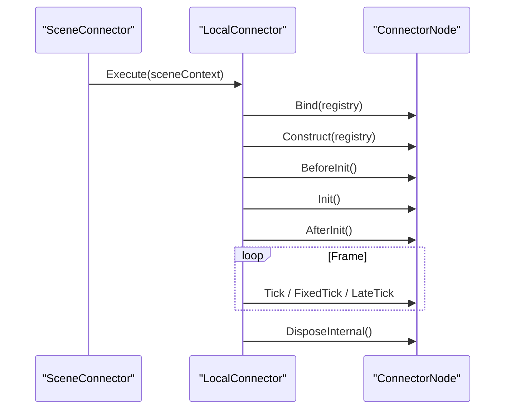

# AbyssMoth Node Framework Cookbook (RU)

- Актуально для ветки пакета: `v3.x` (текущая сборка `3.0.0`)
- Unity: `6000.3+`

## 1) Быстрый старт (2 клика)

После импорта пакета:

1. `Edit -> AbyssMoth Node Framework -> Initialize Project`
2. `Edit -> AbyssMoth Node Framework -> > Validate Full Current Scenes`

После этого проект уже в рабочем состоянии:
- подготовлены `ProjectRootConnector` и `FrameworkConfig` в `Resources`,
- сцена валидирована,
- `SceneConnector` и `LocalConnector` собраны.

## 2) Архитектурная цепочка

`AppEntry -> SceneOrchestrator -> ProjectRootConnector -> SceneConnector -> LocalConnector -> ConnectorNode`

- `ProjectRootConnector` держит `ProjectContext` (`ServiceContainer`) между сценами.
- `SceneConnector` создает `SceneContext` (`ServiceContainer` с parent = project).
- `LocalConnector` исполняет ноды в предсказуемом порядке.

## 3) Lifecycle ноды (что и когда)

Последовательность:

1. `Bind(ServiceContainer)`
2. `Construct(ServiceContainer)`
3. `BeforeInit()`
4. `Init()`
5. `AfterInit()`
6. `Tick/FixedTick/LateTick`
7. `DisposeInternal()`



Когда лучше брать зависимости:
- обычно в `Construct`,
- если зависимость может появиться позже (через соседний installer) — безопаснее в `AfterInit`.

## 4) Почему `registry.Get<SceneConnector>()` не null

Потому что `SceneConnector` добавляет себя в `SceneContext` при `Execute`.

```csharp
sceneContext = new ServiceContainer(parentContainer: projectContext);
sceneContext.Add(this);
```

Поэтому внутри сценовых нод `registry.Get<SceneConnector>()` работает сразу.

## 5) Спавн без ожидания кадра

Используй `InstantiateAndRegister`.

```csharp
var sceneConnector = registry.Get<SceneConnector>();
var index = registry.Get<SceneEntityIndex>();

var spawned = sceneConnector.InstantiateAndRegister(heroPrefab);
spawned.SetEntityTag("Hero");

index.TryGetFirstByTag("Hero", out var hero);
```

Поиск по тегу доступен сразу после спавна.

## 6) Пауза

Пауза всей сцены:

```csharp
sceneConnector.OnPauseRequest(this);
sceneConnector.OnResumeRequest(this);
```

Пауза отдельной фичи:

```csharp
localConnector.OnPauseRequest(this);
localConnector.OnResumeRequest(this);
```

## 7) Где что в меню

- `Edit/AbyssMoth Node Framework/*` — init/validate пайплайн
- `GameObject/AbyssMoth Node Framework/*` — добавление `SceneConnector`/`LocalConnector`
- `Assets/Create/AbyssMoth Node Framework/*` — prefab/asset helpers
- `AbyssMoth/Tools/*` — explorer/tools для проверки структуры

## 8) Доп. материалы

- Философия и структура: `Documentation/AbyssMothNodeFrameworkPhilosophy.md`
- Lifecycle и шаблоны нод: `Documentation/ConnectorLifecycleAndNodeTemplates.md`
- `SceneEntityIndex` API: `Documentation/SceneEntityIndexAPI.md`
- `ServiceContainer` API: `Documentation/ServiceContainerAPI.md`
- `FrameworkConfig` и логирование: `Documentation/FrameworkConfigAndLogger.md`
- Zenject-like сценарии: `Documentation/ZenjectLikeInstallers.md`
